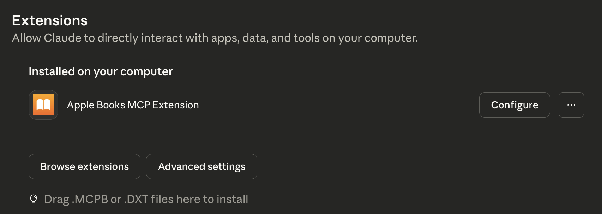

# Apple Books MCP Server Setup

## Quick Setup for Claude Desktop

1. Download .mcpb file
2. Open Connectors -> Extensions in Claude Desktop
3. Drag .mcpb into page

 

4. Submit queries to list all your collection!

 
